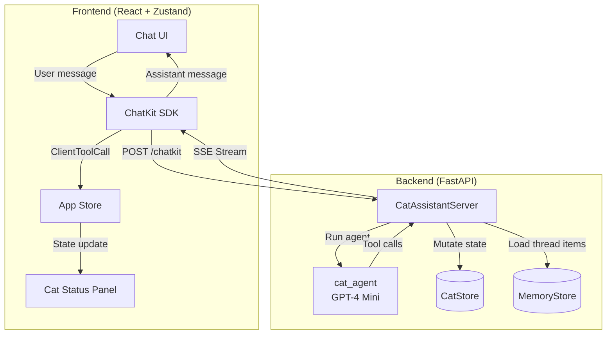
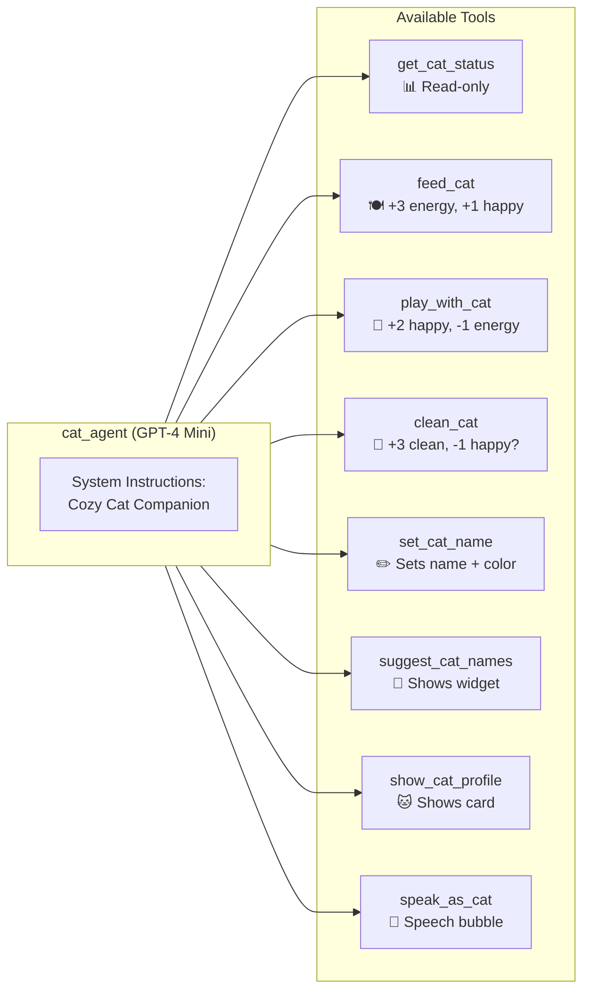
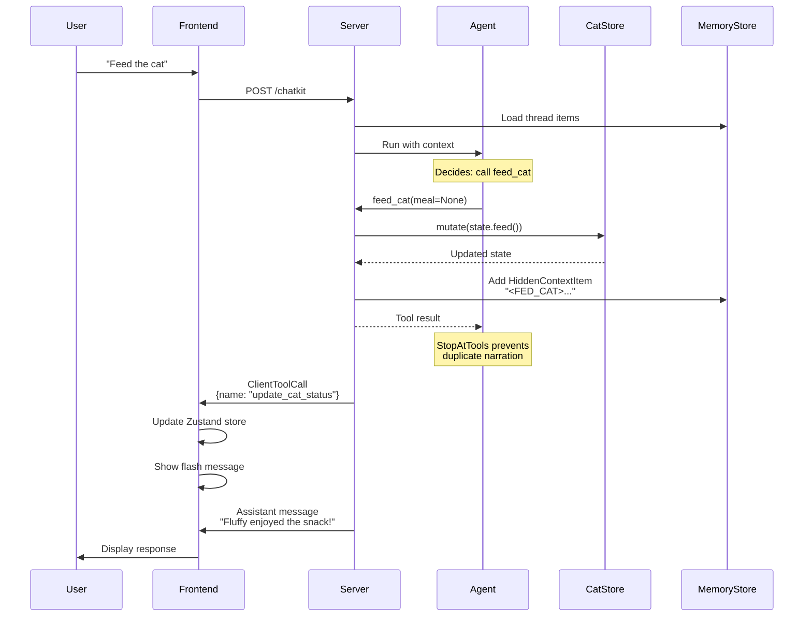
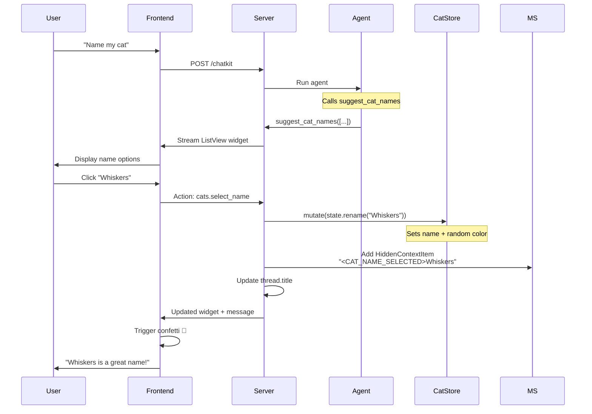
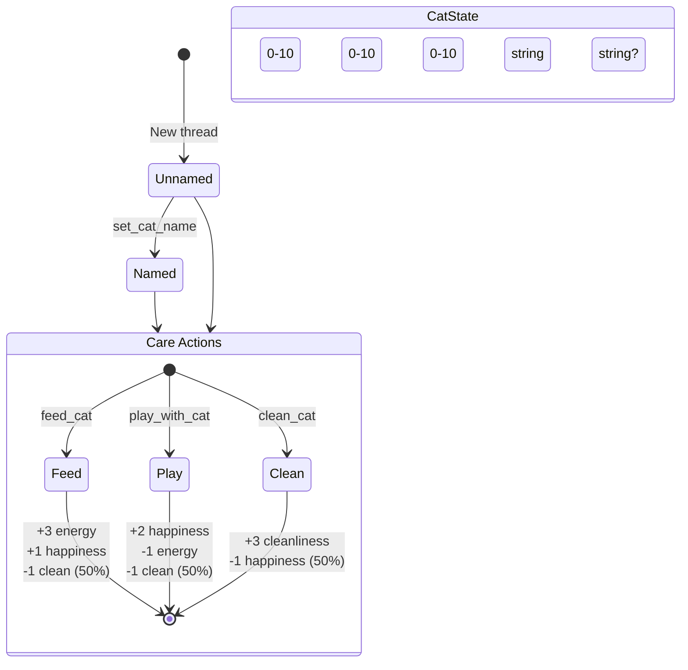
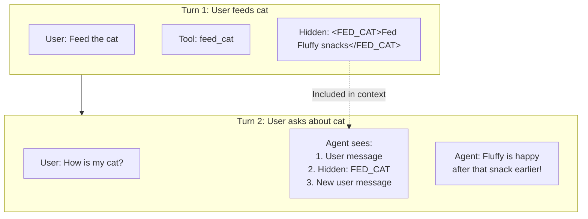
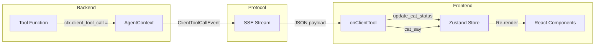

# Cozy Cat Lounge - Agentic Workflow

## Main Request/Response Flow



## Agent Tool Architecture



## State Mutation Flow (e.g., Feed Cat)



## Widget Interaction Flow (Name Selection)



## State Model



## Hidden Context Pattern



## ClientToolCall Mechanism



## Complete Tool Reference

| Tool | Inputs | State Changes | UI Effect |
|------|--------|---------------|-----------|
| `get_cat_status` | none | none | none |
| `feed_cat` | meal? | energy+3, happy+1, clean-1? | Flash message |
| `play_with_cat` | activity? | happy+2, energy-1, clean-1? | Flash message |
| `clean_cat` | method? | clean+3, happy-1? | Flash message |
| `set_cat_name` | name | name, color_pattern | Confetti |
| `suggest_cat_names` | suggestions[] | none | ListView widget |
| `show_cat_profile` | age?, toy? | age | Card widget |
| `speak_as_cat` | line | none | Speech bubble |

## File Structure

```
examples/cat-lounge/
├── backend/
│   └── app/
│       ├── main.py              # FastAPI + /chatkit endpoint
│       ├── server.py            # CatAssistantServer
│       ├── agents/
│       │   └── cat_agent.py     # Agent + all tools
│       ├── data/
│       │   └── cat_store.py     # CatState + CatStore
│       └── widgets/
│           └── cat_widgets.py   # Widget builders
└── frontend/
    └── src/
        ├── App.tsx
        ├── components/
        │   ├── ChatKitPanel.tsx
        │   └── CatStatusPanel.tsx
        └── store/
            └── useAppStore.ts   # Zustand state
```
