# Cozy Cat Lounge - Agentic Workflow

## Main Request/Response Flow


## Agent Tool Architecture

```mermaid
flowchart LR
    subgraph Agent["cat_agent (GPT-4 Mini)"]
        Instructions[System Instructions:<br/>Cozy Cat Companion]
    end

    subgraph Tools["Available Tools"]
        get[get_cat_status<br/>📊 Read-only]
        feed[feed_cat<br/>🍽️ +3 energy, +1 happy]
        play[play_with_cat<br/>🎾 +2 happy, -1 energy]
        clean[clean_cat<br/>🛁 +3 clean, -1 happy?]
        name[set_cat_name<br/>✏️ Sets name + color]
        suggest[suggest_cat_names<br/>📝 Shows widget]
        profile[show_cat_profile<br/>🐱 Shows card]
        speak[speak_as_cat<br/>💬 Speech bubble]
    end

    Agent --> get
    Agent --> feed
    Agent --> play
    Agent --> clean
    Agent --> name
    Agent --> suggest
    Agent --> profile
    Agent --> speak
```



## State Mutation Flow (e.g., Feed Cat)


## Widget Interaction Flow (Name Selection)


## State Model


## Hidden Context Pattern


## ClientToolCall Mechanism


## Complete Tool Reference

| Tool | Inputs | State Changes | UI Effect |
|------|--------|---------------|-----------|
| `get_cat_status` | none | none | none |
| `feed_cat` | meal? | energy+3, happy+1, clean-1? | Flash message |
| `play_with_cat` | activity? | happy+2, energy-1, clean-1? | Flash message |
| `clean_cat` | method? | clean+3, happy-1? | Flash message |
| `set_cat_name` | name | name, color_pattern | Confetti |
| `suggest_cat_names` | suggestions[] | none | ListView widget |
| `show_cat_profile` | age?, toy? | age | Card widget |
| `speak_as_cat` | line | none | Speech bubble |

## File Structure

```
examples/cat-lounge/
├── backend/
│   └── app/
│       ├── main.py              # FastAPI + /chatkit endpoint
│       ├── server.py            # CatAssistantServer
│       ├── agents/
│       │   └── cat_agent.py     # Agent + all tools
│       ├── data/
│       │   └── cat_store.py     # CatState + CatStore
│       └── widgets/
│           └── cat_widgets.py   # Widget builders
└── frontend/
    └── src/
        ├── App.tsx
        ├── components/
        │   ├── ChatKitPanel.tsx
        │   └── CatStatusPanel.tsx
        └── store/
            └── useAppStore.ts   # Zustand state
```
